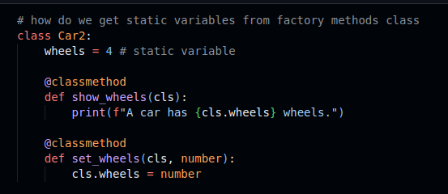

# Advanced Computer Programming Course in Python 🚀

Welcome to the **Advanced Computer Programming Course** repository! This project contains an interactive Jupyter Notebook designed to explore and apply advanced Python programming concepts. 

Whether you're looking to deepen your understanding of Object-Oriented Programming (OOP), file handling, or advanced Python mechanics, this repository serves as a practical, hands-on guide.

## 📝 Overview

The core of this repository is an interactive course notebook that transitions you from basic Python scripts to robust, advanced programming paradigms. 

### Object-Oriented Programming (OOP)
A major focus of this course is understanding how to structure code using classes and methods. Below is a visual representation of class methodologies covered in the material:



## 📂 Repository Contents

* **`course_advanced.ipynb`**: The main Jupyter Notebook containing the advanced Python lessons, code snippets, and practical exercises.
* **`log.txt`**: A sample text file used in the course to demonstrate advanced file I/O operations, logging, and data persistence in Python.
* **`method_class.png`**: A visual diagram illustrating class methods and OOP concepts discussed in the notebook.

## 🧠 Key Concepts Covered

While working through `course_advanced.ipynb`, you will encounter topics such as:
* **Object-Oriented Programming (OOP):** Classes, objects, inheritance, polymorphism, and encapsulation.
* **Advanced Methods:** Instance methods, class methods (`@classmethod`), and static methods (`@staticmethod`).
* **File Handling:** Reading from and writing to files (e.g., `log.txt`), context managers (`with` statements), and logging.
* **Error & Exception Handling:** Writing robust code that gracefully handles unexpected issues.
* **Advanced Data Structures:** Deeper dives into comprehensions, generators, and iterators.

## 🛠️ Requirements & Setup

To run this course notebook locally, you need Python installed along with Jupyter. 

### How to run:

Clone the repository to your local machine:
```bash
git clone https://github.com/marius2347/Advanced-Computer-Programming-Course-in-Python.git
```
Navigate to the project directory:

```bash
cd Advanced-Computer-Programming-Course-in-Python
```

Start Jupyter Notebook:

```bash
jupyter notebook
```

Open `course_advanced.ipynb` and run the cells!

### 🤝 Contributing
Feel free to fork this repository, explore the advanced scripts, and submit pull requests if you have any improvements or new advanced Python topics to add!

### 📬 Contact
If you have any questions, suggestions, or just want to connect, feel free to reach out:

**Email:** mariusc0023@gmail.com
